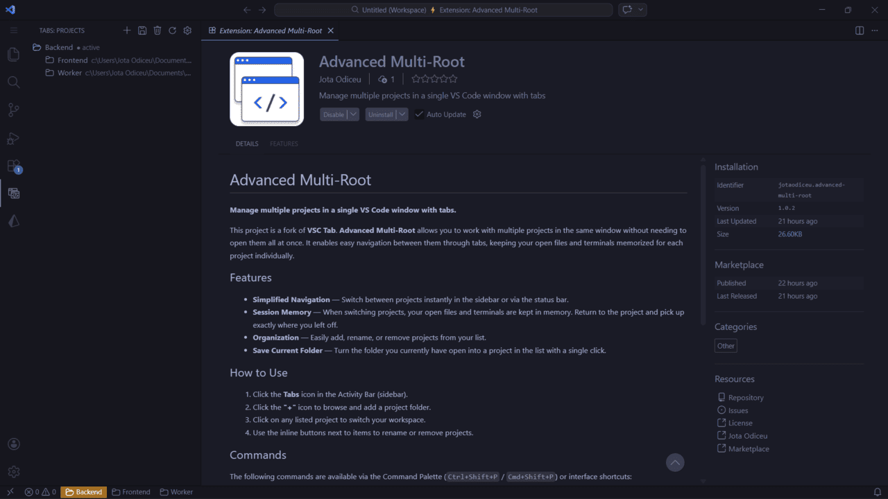
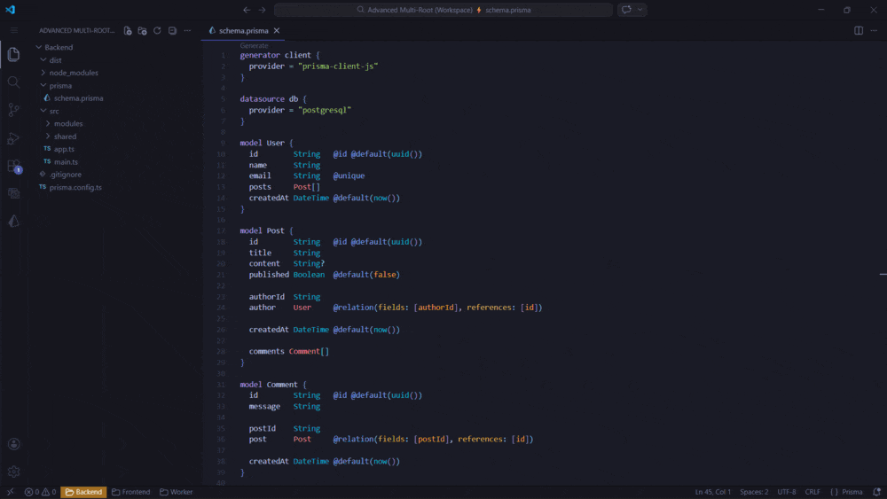

# Advanced Multi-Root

**Manage multiple projects in a single VS Code window with tabs.**

  

This project is a fork of **VSC Tab**. **Advanced Multi-Root** lets you work
with several projects in the same window without opening them all at once. Each
project is a tab you can switch to; switching swaps the workspace folders and
restores the editors you had open for that project.

## Features

- **Simplified Navigation** — Switch between projects instantly from the
  sidebar, from the status bar item (which shows the active project), or with
  the `Next Project` / `Previous Project` commands.
- **Session Memory** — Each project remembers the files you had open, which
  editor group they were in, which tab was active and which were pinned.
  Switch back and pick up where you left off.
- **Multi-root projects** — A project can hold more than one folder. Pick
  several folders when adding a project, or save a multi-root workspace as
  one project.
- **Organization** — Add, rename, or remove projects from your list.
- **Save Current Workspace** — Turn the workspace you currently have open
  (all of its folders) into a project with a single click.

> **Note on terminals:** terminals belong to the window, so any terminals you
> have open stay open across a switch. The extension does not tie terminals to
> a specific project or hide them.

  

## How to Use

1. Click the **Tabs** icon in the Activity Bar (sidebar).
2. Click the **"+"** icon to browse and add one or more folders as a project.
3. Click a listed project to switch your workspace to it.
4. Use the inline buttons next to an item to rename or remove it.

## Commands

Available from the Command Palette (`Ctrl+Shift+P` / `Cmd+Shift+P`) or the
view's inline buttons:

| Command                                             | Command ID              | Description                                                    |
|-----------------------------------------------------|-------------------------|----------------------------------------------------------------|
| Advanced Multi-Root: Add Project                    | `tabs.addTab`           | Add one or more folders as a new project.                      |
| Advanced Multi-Root: Rename Project                 | `tabs.renameTab`        | Rename the selected project.                                   |
| Advanced Multi-Root: Open Project                   | `tabs.switchTab`        | Open / switch to the selected project.                         |
| Advanced Multi-Root: Switch to Project by ID        | `tabs.switchTabById`    | Switch to a specific project (used internally).                |
| Advanced Multi-Root: Switch Project...              | `tabs.quickSwitch`      | Pick a project from a quick pick (`Ctrl+Alt+P`).               |
| Advanced Multi-Root: Next Project                   | `tabs.nextProject`      | Switch to the next project in the list (`Ctrl+Alt+]`).         |
| Advanced Multi-Root: Previous Project               | `tabs.previousProject`  | Switch to the previous project in the list (`Ctrl+Alt+[`).     |
| Advanced Multi-Root: Save Current Folder as Project | `tabs.saveCurrentAsTab` | Save the current workspace (all its folders) as a project.     |
| Advanced Multi-Root: Refresh Projects               | `tabs.refresh`          | Refresh the project list.                                      |
| Advanced Multi-Root: Remove Project                 | `tabs.removeTab`        | Remove the selected project.                                   |
| Advanced Multi-Root: Remove All Projects            | `tabs.removeAll`        | Remove every project from the list.                            |
| Advanced Multi-Root: Settings                       | `tabs.openSettings`     | Open extension settings (set the default folder).              |

## Why Advanced Multi-Root?

VS Code supports multi-root workspaces, but switching between them quickly is
still cumbersome. Advanced Multi-Root gives you a tab-based project switcher
that restores each project's open editors as you move between them.

## License

[MIT](LICENSE)
